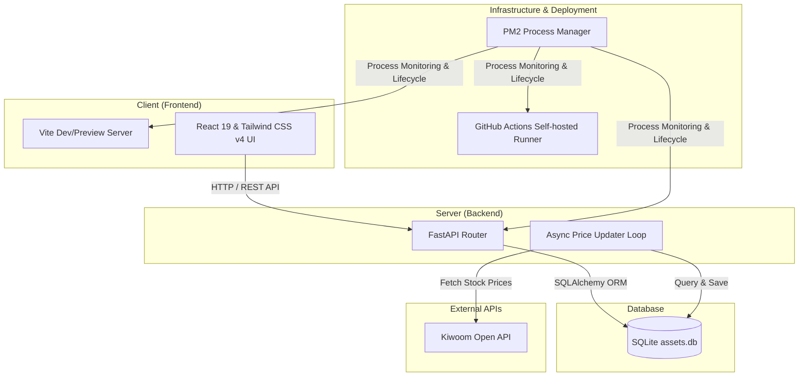

# AssetManager 💼

**AssetManager**는 기존의 수동적인 스프레드시트 기반 자산 관리에서 벗어나, 데이터 수집, 가치 평가, 시각화를 자동화하기 위해 설계된 **홈 서버 기반 개인/가족 통합 자산 관리 플랫폼**입니다.
다양한 금융 기관에 흩어져 있는 자산군(현금, 주식, 배당주, 연금저축 등)을 하나의 대시보드에서 효율적으로 제어하고 모니터링할 수 있도록 돕습니다.

---

## 1. 주요 목표 (Goals)

* **수작업 최소화:** 주가 등 외부 데이터의 자동 업데이트를 통해 월간 '업데이트 체크리스트' 수동 작업을 제거.
* **데이터 통제권 확보:** 구글 시트에 의존하지 않고, 자체 데이터베이스를 구축하여 데이터 안정성과 쿼리 활용성 극대화.
* **통합 시각화 및 추적:** 부부(준, 성은)의 현금, 일반 주식, 배당주, 연금저축 등 다양한 형태의 자산과 계좌 내역을 하나의 대시보드에서 통합 추적.

---

## 🏗️ 시스템 아키텍처 (System Architecture)

본 프로젝트는 홈 서버 환경에서의 효율성과 서비스 지속성을 고려하여 다음과 같은 구조로 설계되었습니다.



---

## 🛠️ 기술 스택 및 채택 이유 (Tech Stack)

### Backend
| 기술           | 역할                            | 채택 이유                                                                                                                           |
| :------------- | :------------------------------ | :---------------------------------------------------------------------------------------------------------------------------------- |
| **FastAPI**    | REST API 서버                   | 뛰어난 비동기(async/await) 지원으로 클라이언트의 요청 처리와 백그라운드 스케줄러 태스크를 지연 없이 병렬 처리하기 위해 채택.        |
| **SQLAlchemy** | ORM (Object-Relational Mapping) | 파이썬 객체 지향적인 데이터 액세스 모델을 제공하여 복잡한 자산/거래 쿼리를 직관적이고 효율적으로 작성.                              |
| **SQLite**     | 메인 데이터베이스               | 홈 서버의 자원 제약 상황에서 오버헤드가 적고 파일 백업 및 마이그레이션 관리가 용이하여 로컬 환경에 최적화된 DB로 채택.              |
| **`uv`**       | 패키지 및 가상환경 관리         | 기존 `pip` 및 `venv` 대비 압도적으로 빠른 의존성 설치 속도와 예측 가능한 패키지 락킹(`uv.lock`)을 제공하여 일관된 실행 환경을 보장. |

### Frontend
| 기술                | 역할                   | 채택 이유                                                                                    |
| :------------------ | :--------------------- | :------------------------------------------------------------------------------------------- |
| **React 19**        | UI 라이브러리          | 최신 React 기능(Actions 등)을 바탕으로 복잡한 대시보드 상태 관리 및 렌더링 최적화를 달성.    |
| **Vite**            | 빌드 도구 및 개발 서버 | 매우 빠른 HMR(Hot Module Replacement)과 프로덕션 빌드 속도로 개발 및 배포 생산성을 극대화.   |
| **Tailwind CSS v4** | 스타일링 프레임워크    | 컴포넌트 중심의 신속한 반응형 레이아웃 구현 및 일관된 디자인 시스템 적용을 위해 도입.        |
| **`pnpm`**          | 패키지 매니저          | 콘텐츠 주소 지정이 가능한 저장소를 활용해 디스크 공간을 절약하고 중복 종목 빌드 시간을 단축. |

### Infrastructure & DevOps
| 기술                      | 역할                   | 채택 이유                                                                                                                                         |
| :------------------------ | :--------------------- | :------------------------------------------------------------------------------------------------------------------------------------------------ |
| **PM2**                   | 프로세스 매니저        | 백엔드(FastAPI) 및 프론트엔드(Vite Preview) 웹 프로세스가 백그라운드에서 비정상 종료 시 자동 재시작되도록 생명주기를 제어하고 실시간 로그를 수집. |
| **GitHub Actions Runner** | CI/CD 셀프 호스트 러너 | 클라우드 크레딧이나 제약 없이 자체 홈 서버 내부에서 빌드 및 통합 테스트가 자동으로 실행되도록 인프라를 로컬 구축하고 PM2로 상시 가동.             |

---

## 🌟 핵심 기능 (Key Features)

1. **실시간 자산 현황 대시보드 (Dashboard)**
   - 총 순자산, 총 투자수익률(ROI), 연도별/월별 자산 증감 추이 시각화.
   - 자산군별(현금, 일반 주식, 배당주, 연금 등) 및 계좌별 평가액 비중 차트 제공.
2. **시세 자동 업데이트 (Automation)**
   - 키움증권 Open API 및 yfinance API를 연동하여 백그라운드 비동기 루프(`lifespan` 내 1시간 주기 실행)를 통해 국내/해외 주식 시세 자동 갱신 및 반영 (환율 및 예수금은 수동 관리).
3. **금융 거래 내역 관리 (Transaction Management)**
   - 계좌별 거래 내역(매수, 매도, 입출금 등) 기록 및 자산 잔액 자동 계산 기능.
4. **데이터 무결성 관리 (Database Administration)**
   - 서버 기동 시 자동으로 수행되는 스키마 마이그레이션(SQLite 스크립트 기반) 및 주기적인 DB 백업 자동화(`BackupService`).

---

## 🧪 테스트 및 품질 보증 전략 (Testing & QA)

이 프로젝트는 프로덕션 환경의 안정성을 담보하고, 빈번한 기능 추가 속에서도 무결성을 유지하기 위해 두 가지 레이어의 테스트 전략을 채택하고 있습니다.

### 1. 테스트 주도 개발 (TDD)
- 백엔드 비즈니스 도메인 및 API 엔드포인트에 대해 `pytest`를 활용하여 프로덕션 코드 작성 전 테스트를 먼저 구현합니다.
- 테스트 동작 시 운영 DB를 오염시키지 않도록 격리된 인메모리 혹은 별도의 테스트 DB 인프라 환경에서 검증을 수행합니다.

### 2. Playwright를 통한 시나리오별 E2E 테스트
- 프론트엔드와 백엔드가 결합된 실제 동작 흐름을 자동 검증하기 위해 **Playwright** 기반의 E2E 테스트 스크립트들을 작성했습니다.
- **주요 검증 시나리오:**
  - 대시보드 기간별 필터링 기능 검증
  - 관심종목(Watchlist) 추가/삭제 시나리오
  - 복합 자산 평가액 및 섹터별 비율 계산 정확성 검증
  - 트랜잭션 수동 수정 시 DB 반영 상태 실시간 검증
- E2E 테스트 실행 시에는 자동 스크립트(`scripts/dev.py`)가 가동되어 격리된 개발용 DB(`src/dev_assets.db`)를 바라보고 서버를 띄워, 운영 데이터 오염을 완벽히 방지합니다.

---

## 🚀 서버 구동 방법 (Running the Servers)

이 프로젝트는 개발 환경 및 운영 환경에 따라 서버 구동 스크립트를 분리하여 제공합니다. 시스템에 `uv`와 `pnpm`이 설치되어 있어야 합니다.

### 1. 개발 환경 서버 구동 (Development)
E2E 테스트 및 개발 중 실제 데이터 오염을 방지하기 위해 격리된 개발용 데이터베이스(`src/dev_assets.db`)를 사용하여 서버를 구동합니다.
```bash
uv run scripts/dev.py
```
*이 명령어를 실행하면 필요한 경우 백엔드(Python) 및 프론트엔드(pnpm) 의존성을 자동으로 설치하고, 개발용 백엔드 서버와 프론트엔드 서버를 동시에 구동합니다.*

### 2. 운영 환경 서버 구동 (Production)
실제 운영 데이터가 담기는 운영 데이터베이스(`src/assets.db`)를 사용하여 서버를 구동합니다.
```bash
uv run scripts/run_prod.py
```
*주의: 실제 데이터가 변경될 수 있으므로 E2E 테스트 등을 진행할 때는 이 명령어를 사용하지 마십시오.*

### 3. PM2를 이용한 운영 환경 상시 구동 (Production with PM2)
운영 서버가 백그라운드에서 중단 없이 상시 구동되도록 PM2(Process Manager 2)를 사용할 수 있습니다. PM2 설정 파일(`ecosystem.config.js`)에 등록된 `run_prod.py` 스크립트를 통해 자동으로 프론트엔드 최적화 빌드 후 배포용 preview 서버가 구동됩니다.

PM2가 설치되어 있는지 확인한 후 실행합니다 (미설치 시 `npm install -g pm2`로 설치):
```bash
# PM2로 서버 기동
pm2 start ecosystem.config.js
```

**유용한 PM2 명령어:**
* **상태 모니터링:** `pm2 status`
* **실시간 로그 조회:** `pm2 logs asset-manager-prod`
* **서버 재기동:** `pm2 restart asset-manager-prod`
* **서버 종료 및 등록 해제:** `pm2 delete asset-manager-prod`

### 4. PM2를 이용한 GitHub Self-hosted Runner 구동 (GitHub Runner with PM2)
GitHub Actions Self-hosted Runner를 PM2를 사용하여 백그라운드에서 상시 안정적으로 실행하고 관리할 수 있습니다. `ecosystem.config.js`에 설정이 함께 등록되어 있으므로 간단하게 제어가 가능합니다.

```bash
# GitHub Runner 개별 기동
pm2 start ecosystem.config.js --only asset-manager-gh-runner

# 또는, 애플리케이션 서버와 GitHub Runner를 동시에 기동
pm2 start ecosystem.config.js
```

**러너 관리를 위한 유용한 PM2 명령어:**
* **실시간 로그 조회:** `pm2 logs asset-manager-gh-runner`
* **러너 재기동:** `pm2 restart asset-manager-gh-runner`
* **러너 종료 및 등록 해제:** `pm2 delete asset-manager-gh-runner`

설정 파일 없이 직접 명령어로 구동하려는 경우 다음과 같이 실행할 수도 있습니다:
```bash
pm2 start actions-runner/run.sh --name "asset-manager-gh-runner"
```


## 🧪 Running Tests

백엔드와 프론트엔드 전체 테스트를 실행하려면 다음 명령어를 사용하세요:
```bash
uv run scripts/test.py
```
*프론트엔드 테스트 실행 전에도 필요한 패키지가 없다면 자동으로 설치됩니다.*

---

## ⚙️ 안티그래비티 MCP 서버 설정 (Antigravity MCP)

이 프로젝트는 AI 에이전트(안티그래비티)와 협업하여 자산 데이터 조회 및 분석을 수행할 수 있도록 지원하는 **MCP(Model Context Protocol) 서버**를 포함하고 있습니다.

상세한 연동 및 활성화 설정 방법은 아래 가이드를 참고하세요.
* 📖 [안티그래비티 MCP 서버 설정 가이드](mcp_config_guide.md)

