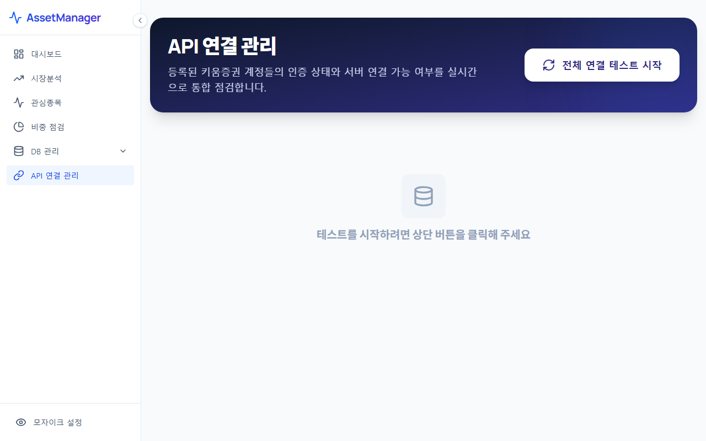

# API 연결 관리 (API Connection)

API 연결 관리 메뉴는 키움 OpenAPI 등 외부 금융기관 플랫폼과 연동하여 주식 시세, 예수금, 보유 잔고 등의 데이터를 자동으로 동기화할 수 있도록 연동 설정을 제어하는 화면입니다.

---

## 1. 화면 예시

---

## 2. 주요 기능 및 구성 요소
* **키움증권 OpenAPI 연동 컨트롤러**:
  * 키움증권 OpenAPI 서비스 연결 상태(Connected / Disconnected)를 모니터링합니다.
  * 로그인 정보, 계좌 비밀번호 저장, 자동 접속 옵션을 설정하고 테스트 연결을 수행할 수 있습니다.
* **보안 및 인증 정보 설정**:
  * API 호출 시 필요한 개인 보안 Key값이나 인증서 경로 설정을 로컬에 암호화하여 보관하도록 관리합니다.
* **수동 연동 및 동기화 버튼**:
  * 자동 연동을 원치 않거나 일시적 오류가 발생한 경우, 수동으로 잔고 동기화 API를 호출하여 즉시 최신 정보를 읽어올 수 있도록 수동 싱크 기능을 제공합니다.

---

## 3. 활용 팁 및 보안 권고사항
> [!CAUTION]
> * API 연동 시 사용되는 인증 번호나 계좌 비밀번호 등 민감 정보는 네트워크 외부로 전송되지 않고 사용자의 **로컬 컴퓨터 내의 보안 영역에만 저장**됩니다. 따라서 안심하고 연동하셔도 좋습니다.
> * 모자이크 설정을 켠 상태에서도 API 연결 관리 화면에서는 키 설정 등의 세부 텍스트가 보호되므로 외부 공유 시 항상 보안 상태를 확인하십시오.
