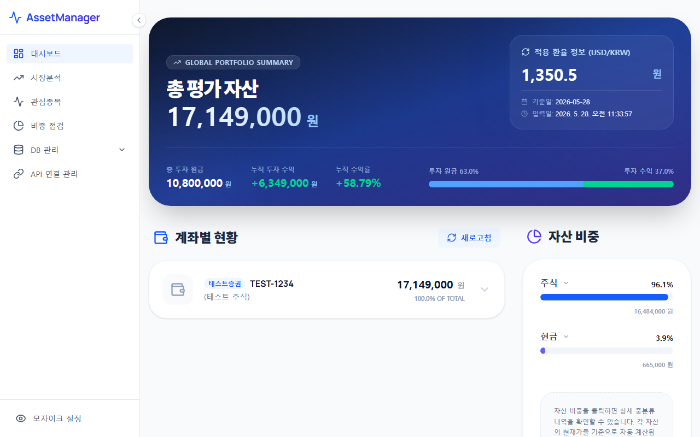

# 자산 현황 대시보드 (Dashboard)

대시보드는 사용자의 전체 자산 규모와 투자 성과를 한눈에 파악할 수 있는 AssetManager의 메인 화면입니다. 과거부터 현재까지 기록된 자산 데이터를 종합하여 직관적인 차트와 수치로 시각화합니다.

---

## 1. 화면 예시

---

## 2. 주요 기능 및 구성 요소
* **총자산 요약 카드**: 현재 보유하고 있는 총자산 평가액, 누적 투자 원금, 그리고 총평가손익 및 누적 수익률을 가장 상단에서 한눈에 보여줍니다.
* **자산 누적수익률 추이 차트**: 과거 자산 스냅샷 데이터를 기반으로 하여 자산의 역사적 가치 변화와 누적 수익률의 흐름을 꺾은선 그래프로 표현합니다. 기간 필터(1개월, 3개월, 1년, YTD 등)를 통해 분석 범위를 조정할 수 있습니다.
* **자산 분류별 비중 차트**: 전체 포트폴리오가 어떤 자산군(예: 국내주식, 미국주식, 채권, 현금, 연금 등)에 얼마나 배분되어 있는지 도넛 차트 형태로 보여줍니다.

---

## 3. 활용 팁 및 주의 사항
> [!TIP]
> * 좌측 하단의 **'모자이크 설정'** 버튼을 누르면 화면에 노출되는 금액 정보가 마스킹 처리(***)됩니다. 카페나 공공장소, 혹은 지인에게 GitHub로 화면을 공유할 때 개인정보를 손쉽게 숨길 수 있습니다.
> * 대시보드의 추이 차트는 **DB 관리 > 스냅샷 생성** 메뉴를 통해 과거 스냅샷 데이터가 정기적으로 누적 기록되어야 정상적인 흐름을 표시할 수 있습니다.
