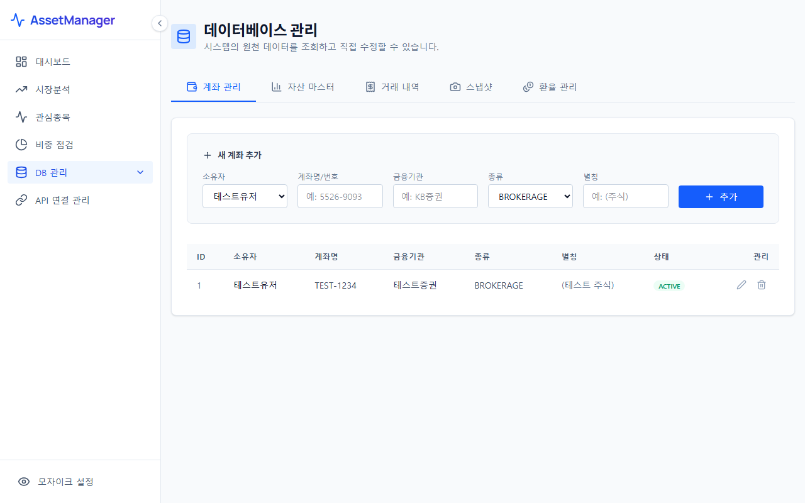

# DB 마스터 관리 (Database Management)

DB 마스터 관리 메뉴는 AssetManager의 기반이 되는 데이터베이스 테이블의 원천 데이터를 조회하고, 메타데이터를 직접 수정 및 보완할 수 있는 관리자 화면입니다.

---

## 1. 화면 예시

---

## 2. 주요 기능 및 구성 요소
* **테이블 목록 조회 및 탭 전환**: 자산(Assets), 계좌(Accounts), 종목 메타(Stocks), 환율(Exchanges) 등 핵심 관계형 테이블의 생 데이터를 웹 인터페이스 상에서 간편하게 조회할 수 있습니다.
* **마스터 데이터 수정/추가/삭제**: 특정 행을 직접 클릭하여 계좌 번호 수정, 별칭 부여, 신규 수동 자산 등록 등의 마스터 정보 편집 작업을 수행할 수 있습니다.
* **데이터 백업 및 복구**:
  * DB 손상을 방지하기 위해 현재 시점의 `assets.db` 파일을 백업 버전으로 내보내거나(Export), 보관해 둔 백업본을 다시 시스템에 적재(Import)할 수 있는 안정성 도구를 제공합니다.

---

## 3. 주의 사항
> [!CAUTION]
> * 마스터 관리 화면에서 데이터를 수정하거나 삭제할 경우 관련 테이블 간의 참조 무결성(Foreign Key 관계)에 의해 대시보드나 비중 점검 차트가 정상적으로 그려지지 않을 수 있습니다.
> * 중요 데이터를 삭제하거나 대규모 편집을 수행하기 전에는 반드시 상단의 **'DB 백업'** 버튼을 실행하여 백업 파일을 로컬 디바이스에 저장해 두시기를 강력히 권장합니다.
