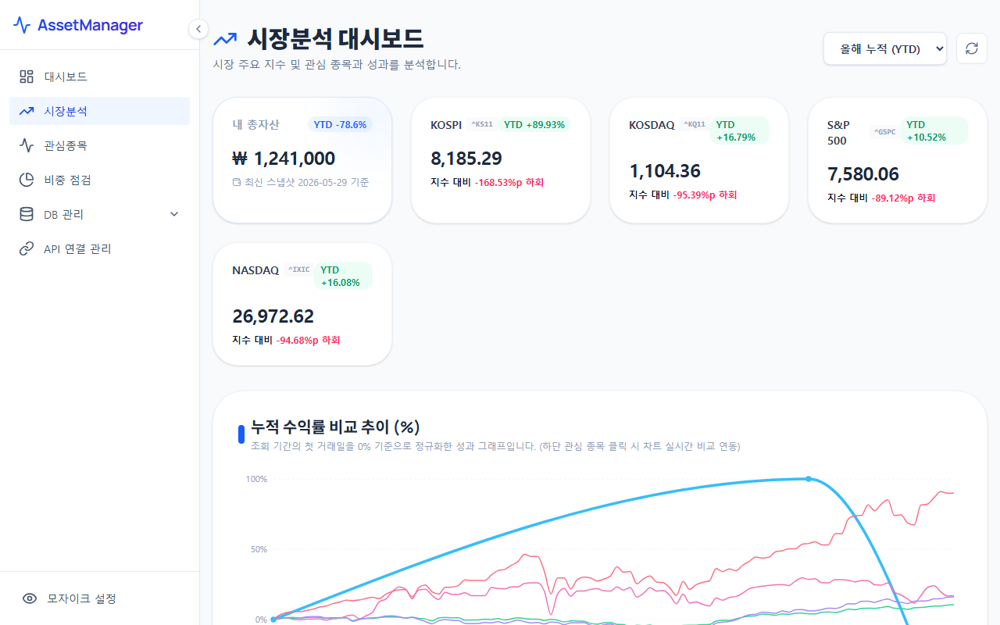

# 시장분석 (Market Analysis)

시장분석 메뉴는 내 자산의 투자 성과를 주요 시장 지수(KOSPI, KOSDAQ 등)와 직접 비교하여 시장 대비 초과 수익(알파)을 달성하고 있는지 분석할 수 있는 도구입니다.

---

## 1. 화면 예시

---

## 2. 주요 기능 및 구성 요소
* **누적 수익률 추이 비교 차트**: KOSPI, KOSDAQ 지수의 누적 수익률 흐름과 내 포트폴리오의 실질 수익률 곡선을 겹쳐서 제공합니다. 이를 통해 시장 대비 내 자산의 성과가 우수했는지 또는 시장 하락기에 방어가 잘 되었는지 한눈에 파악할 수 있습니다.
* **통합 범례 및 제어 컨트롤러**: 차트 하단에 위치한 지수 버튼들을 클릭하여 차트에서 특정 지수를 켜고(ON) 끌(OFF) 수 있는 토글 기능을 제공합니다.
* **수익률 비교 상세 테이블**:
  * **연간 수익률 비교**: 과거 연도별 지수 수익률과 내 자산 수익률을 표 형식으로 일목요연하게 비교합니다.
  * **일간 수익률 비교**: 최근 일자별 시장 등락률과 내 자산의 하루 단위 변동폭을 상세하게 추적합니다.

---

## 3. 활용 팁
> [!TIP]
> * 최근 3개월이나 YTD(연초 대비 수익률) 필터를 적용하여 최근 시장 변동성이 큰 국면에서 내 포트폴리오의 변동성(MDD 등)이 시장 지수 대비 얼마나 안정적이었는지 정량적으로 평가해 보십시오.
> * 만약 포트폴리오 수익률 곡선이 시장 지수 하락 시에도 횡보하거나 완만하게 하락한다면, 채권이나 현금 비중 배분이 적절히 잘 이루어졌음을 증명하는 지표가 됩니다.
