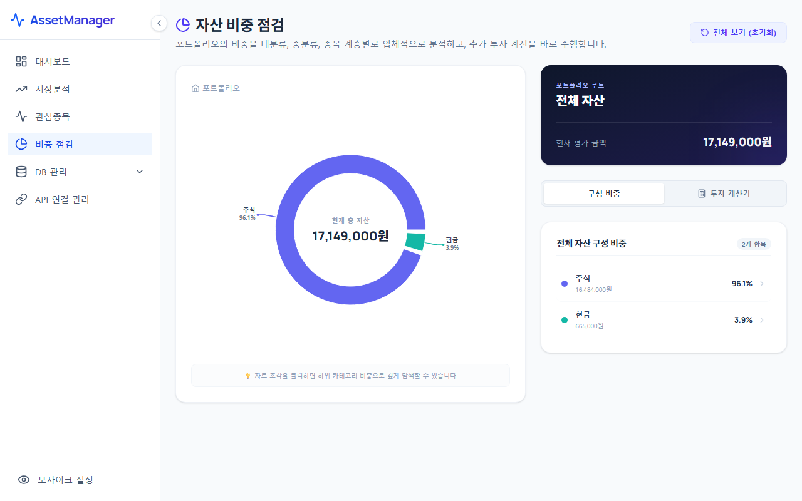

# 자산 비중 점검 및 비율계산기 (Asset Allocation & Calculator)

비중 점검 메뉴는 내 포트폴리오의 자산 배분 상태를 분석하고, 사용자가 설정한 목표 비중에 맞추어 현재 포트폴리오를 조정(리밸런싱)하기 위해 얼마를 추가로 매수하거나 매도해야 하는지 계산해주는 리밸런싱 가이드 도구입니다.

---

## 1. 화면 예시

---

## 2. 주요 기능 및 구성 요소
* **계층형 자산 비중 파이 차트**:
  * **주요 카테고리(Major Category)** 및 **세부 카테고리(Sub Category)** 기준의 비중 분포를 파이 차트로 시각화합니다.
  * 파이 차트의 특정 조각을 클릭하면 해당 카테고리에 속한 개별 종목들의 목록이 동적으로 펼쳐집니다.
* **계좌별 보유 상세 정보**:
  * 각 개별 자산이 어떤 금융기관(증권사/은행)의 어떤 계좌(계좌명 및 계좌번호)에 얼마씩 분산되어 보관되어 있는지 상세히 표시합니다.
  * 복수 계좌에 쪼개져 있는 동일 자산의 총액과 분배 현황을 한눈에 확인할 수 있습니다.
* **목표 비중 대비 괴리 분석 및 비율계산기**:
  * 자산별로 내가 도달하고자 하는 **'목표 비중(%)'**을 입력하면 현재 비중과의 차이(괴리율)를 자동으로 산출합니다.
  * 추가 투자 예정 금액을 입력하거나 현재 자산 규모 기준으로 리밸런싱을 진행할 때, 목표 비중을 맞추기 위해 **자산별로 추가로 매수해야 하는 금액(+) 또는 매도해야 하는 금액(-)**을 자동으로 계산하여 제안합니다.

---

## 3. 활용 팁 및 프로세스
> [!TIP]
> **효과적인 3단계 리밸런싱 프로세스**:
> 1. 파이 차트 및 계좌 상세 내역을 통해 현재 비대해진 자산군(예: 급등한 주식)과 소외된 자산군(예: 현금)을 식별합니다.
> 2. 자산별 목표 비중 입력 란에 원하는 포트폴리오 비율을 입력합니다. (합산 100%가 되도록 조정)
> 3. 하단 **비율계산기**에 이번 달 추가 저축액(예: 1,000,000원)을 입력하면, 포트폴리오를 해치지 않고 목표 비중에 도달할 수 있도록 자산별 배분 가이드 금액이 출력됩니다. 이 가이드에 따라 기계적 매수를 진행하십시오.
