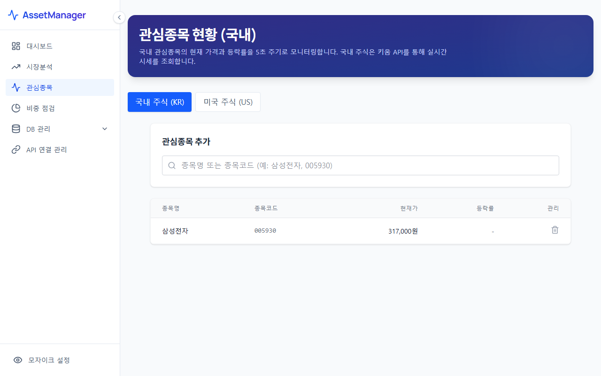

# 관심종목 (Watchlist)

관심종목 메뉴는 사용자가 매수를 고려하고 있거나 시장 동향 파악을 위해 등록해 둔 주식 종목(국내 및 해외)의 시세와 차트를 모니터링할 수 있는 화면입니다.

---

## 1. 화면 예시

---

## 2. 주요 기능 및 구성 요소
* **국내/해외 관심종목 탭**: 한국 시장(KOSPI, KOSDAQ)과 해외 시장(NYSE, NASDAQ 등)의 종목을 탭 단위로 나누어 체계적으로 분류 및 모니터링합니다.
* **실시간 시세 요약**: 등록된 종목의 현재가, 전일 대비 등락률, 거래대금, 시가총액 등 주요 재무 및 시세 지표를 표 형태로 제공합니다.
* **관심종목 차트 비교**: 개별 종목들의 주가 흐름을 선형 차트로 제공하며, 지수 대비 개별 종목의 강세/약세 국면을 관찰할 수 있도록 돕습니다.

---

## 3. 활용 팁
> [!TIP]
> * 새로 포트폴리오에 편입하고자 하는 후보군 종목이 있다면, 이곳에 먼저 등록해두고 시장 지수가 급락했을 때 해당 종목들이 지수 대비 얼마나 강하게 반등하는지(상대 강도)를 확인하는 용도로 쓰면 매우 유용합니다.
> * 주식 시세 데이터는 내부 배치 스크립트 또는 OpenAPI 연동 상태에 따라 최신 가격으로 업데이트됩니다.
