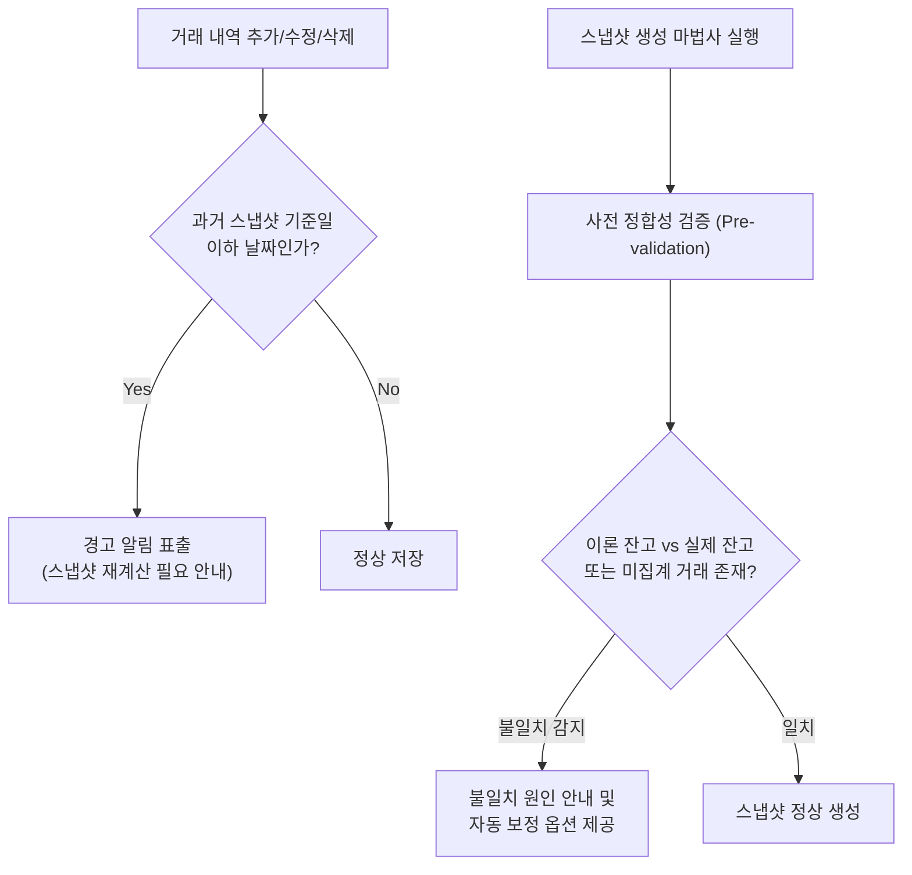

# 스냅샷 정합성 보장 및 불일치 재발 방지를 위한 아키텍처 개선안

## 1. 배경 및 문제 정의

### 현상 및 근본 원인
현재 스냅샷 엔진(`SnapshotEngine`)은 특정 기준일(`snapshot_date`)의 스냅샷을 생성할 때 다음과 같은 방식으로 입출금을 집계합니다:
```python
Transaction.transaction_date > last_snapshot_date
AND Transaction.transaction_date <= current_snapshot_date
```
* **문제 상황**:
  1. `last_snapshot_date` 당일에 거래가 발생했으나, 스냅샷 생성 버튼을 누른 **이후**에 거래 내역(예: 100만 원 입금)이 입력된 경우.
  2. 과거 일자로 거래 내역이 소급 입력되거나 수정/삭제된 경우.
* **결과**:
  * 과거 스냅샷에는 해당 거래가 반영되지 않고 잔고/수익이 확정됨.
  * 다음 스냅샷에서는 `transaction_date > last_snapshot_date` 조건으로 인해 해당 거래가 집계 대상에서 영구 제외됨.
  * 계좌 잔고 변동과 집계된 입출금 사이의 차액이 고스란히 '수익'으로 왜곡되어 대시보드 수익과 스냅샷 계좌별 수익 합계 간 불일치를 유발함.

---

## 2. 단계별 개선안



---

### ① 단기 개선안: UI/API 수준의 사전 방어 및 정합성 검증

#### 1. 거래 내역 입력/수정 시 과거 스냅샷 영향 경고
* **로직**:
  * 사용자가 거래 내역(`transactions`)을 등록, 수정, 삭제할 때 해당 계좌의 최신 스냅샷 일자(`last_snapshot_date`)와 거래 일자(`transaction_date`)를 비교.
  * 만약 `transaction_date <= last_snapshot_date`인 경우:
    * API 응답에 경고 메시지(`warning`) 포함: `"입력하신 거래 일자(YYYY-MM-DD)는 이미 확정된 스냅샷 기준일 이전이므로 스냅샷 정합성에 영향을 줄 수 있습니다."`
    * 프론트엔드 모달/토스트 알림으로 사용자에게 인지시킴.

#### 2. 스냅샷 생성 마법사(Wizard) 내 사전 유효성 검사 (Pre-validation)
* **로직**:
  * 스냅샷 생성 미리보기 단계에서 단순 계산뿐만 아니라, **이전 스냅샷 잔고 + 기간 순입출금 + 기간 실현/평가손익 == 현재 잔고** 정합성을 사전 검증.
  * 은행/현금성 수신 계좌(이자 외에 매매손익이 없는 계좌)에서 수익(`total_profit`)이 0이 아니거나 비정상적인 차액이 발생할 경우, 마법사 화면에 노란색 경고 뱃지 및 원인 트랜잭션 후보를 표시.

---

### ② 중장기 개선안: 스냅샷 엔진 및 데이터 파이프라인 고도화

#### 1. 스냅샷 재계산 (Re-snapshot) 도구/엔진 도입
* 과거 거래가 수정되거나 누락분이 뒤늦게 입력되었을 때, 특정 날짜 이후의 모든 스냅샷을 연속적으로 재계산(Cascade recalculation)하여 정합성을 일괄 복구하는 스크립트 또는 관리자 API 제공.
* 예: `python scripts/recalculate_snapshots.py --from 2026-08-01`

#### 2. 스냅샷 테이블 스키마 개선
* 현재 `account_snapshots` 테이블의 `total_profit` 컬럼명은 레거시 네이밍으로 인해 누적 수익(Cumulative Profit)인지 기간 수익(Period Profit)인지 혼동을 줌.
* 차기 메이저 리팩토링 시 컬럼명을 `period_profit`으로 명확히 마이그레이션하여 코드 및 데이터베이스 간의 의미 일치 달성.

---

## 3. 구현 우선순위 및 로드맵

| 우선순위 | 항목 | 대상 컴포넌트 | 난이도 |
| :--- | :--- | :--- | :---: |
| **P1** | 스냅샷 마법사 사전 정합성 검증 알림 | `SnapshotWizardModal`, `snapshot_engine.py` | 보통 |
| **P2** | 과거 날짜 거래 입력 시 경고 UI | `TransactionForm`, `transaction_service.py` | 쉬움 |
| **P3** | 스냅샷 일괄 재계산 관리자 스크립트 | `scripts/recalculate_snapshots.py` | 보통 |
| **P4** | `total_profit` $\rightarrow$ `period_profit` 컬럼명 리팩토링 | DB Schema, Backend Models, Frontend DB Tab | 보통 |
